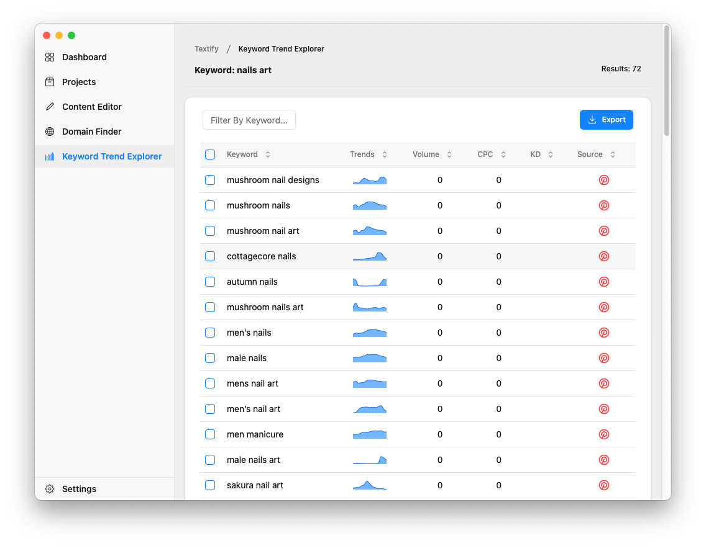

# Textify

📝 An AI writing assistant tool

Textify is an AI-powered writing assistant application designed to help improve your productivity and the quality of your writing.



## Tech Stack

- Backend: [Golang](https://go.dev/)
- GUI: [Wails](https://wails.io/)
- Frontend: [React](https://reactjs.org/) with [Vite](https://vitejs.dev/)
- UI: [TailwindCSS](https://tailwindcss.com/) and [Shadcn-UI](https://ui.shadcn.com/)

## Requirements

- Redis
- Google Chrome

## Local Development

Install [wails](https://github.com/wailsapp/wails) from the official source for packaging.

Note: The official wails packaging cannot run on `win7`. To support `win7`, download [MQEnergy/wails](https://github.com/MQEnergy/wails) and compile it locally:

```shell
cd wails/v2/cmd/wails
go install .
```

Run the tests:

```shell
#
make dev
```

## Installation Package

### Mac Environment

#### 1. Package according to the local environment

```shell
# The ENV parameter can be set to test (for testing) or prod (for production), for example:
make build ENV=prod

# Package into dmg format
make dmg
```

#### 2、Package installation packages for other environments.

```shell
# amd64
make darwin/amd64 ENV=prod

# arm64
make darwin/arm64 ENV=prod
```

## Windows Environment

Note: The installation packages below need to be packaged according to your computer architecture, otherwise the packaging may not be successful.

```shell
# amd64 is a 64-bit version of the X86 architecture CPU. It is also known as X86_64. It is widely used in mainstream desktop PCs, laptops, and servers (including virtual machines).
make windows/amd64 ENV=prod

# arm64 is a 64-bit version of the ARM architecture CPU.
make windows/arm64 ENV=prod

# win32
make windows/386 ENV=prod
```

## Todo List

- [x] Keyword Trend Explorer
- [ ] Content Editor
- [ ] Domain Finder
